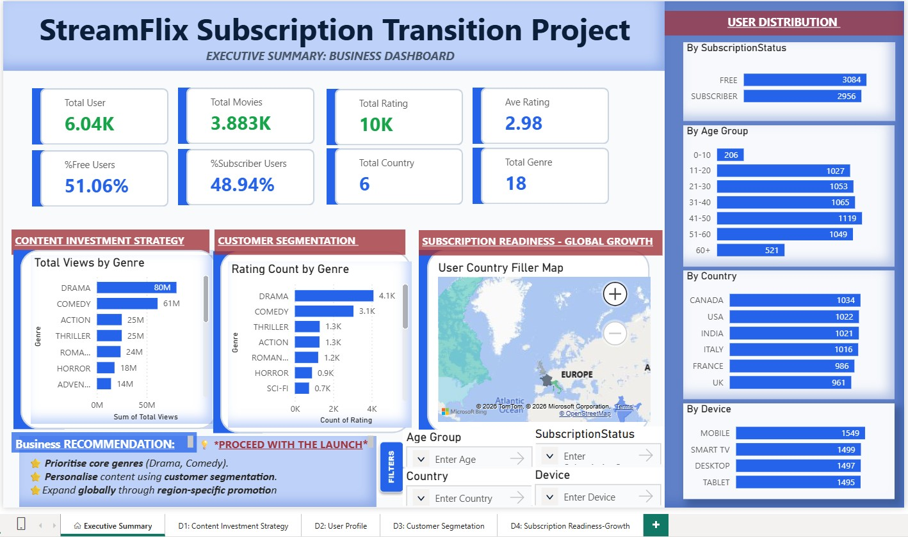

# Subscription Business Analytics Case Study

## Project Overview

This repository showcases my contribution to a team-based analytics capstone project completed during the Generation Australia Data Analytics Bootcamp.

The project explored how data analytics can support a streaming platform's transition from a free, advertising-supported model to a subscription-based business model. The analysis involved data preparation, database development, exploratory analysis and dashboard creation to generate customer and business insights.

---
## Dashboard Preview

### Executive Summary Dashboard

This dashboard provides an overview of key business metrics, customer behaviour and subscription readiness insights.


---
## Project Objectives

The project aimed to:

- Prepare and clean data from multiple sources
- Design and analyse relational data structures
- Apply SQL and Python for data analysis
- Develop interactive Power BI dashboards
- Generate insights to support business decision-making

---

## My Contributions

As part of a four-member team, my contributions included:

- Consolidating project deliverables
- Data preparation and validation
- SQL analysis and database work
- Python-based exploratory analysis using Pandas
- Power BI dashboard development
- Documentation and presentation support

---

## Tools & Technologies

- Excel
- SQL
- Python (Pandas)
- Power BI
- Jupyter Notebook
- GitHub

---

## Repository Structure

```
images/
Dashboard screenshots

powerbi/
Power BI report

python/
Python analysis notebooks

sql/
SQL analysis scripts

docs/
Project documentation
```

---

## Project Workflow

Business Problem  
→ Data Preparation  
→ Database Development  
→ SQL Analysis  
→ Python Exploration  
→ Power BI Dashboard  
→ Business Insights

---
## Dashboard Preview

The following dashboards demonstrate how the project transformed data into business insights to support a subscription-based strategy.

### 1. Executive Summary Dashboard

Provides an overview of key business metrics and performance indicators.



---

## Key Skills Demonstrated

- Data Cleaning
- Data Transformation
- SQL Querying
- Data Analysis
- Data Visualisation
- Dashboard Development
- Business Insight Generation
- Data Storytelling

---

## Project Outcome

This project demonstrates an end-to-end analytics workflow, showing how data can be transformed into meaningful insights to support business decisions.

---

## Acknowledgement

This project was completed collaboratively as part of the Generation Australia Data Analytics Bootcamp. This repository presents selected artefacts and my individual contributions to demonstrate my learning journey and technical capabilities.
